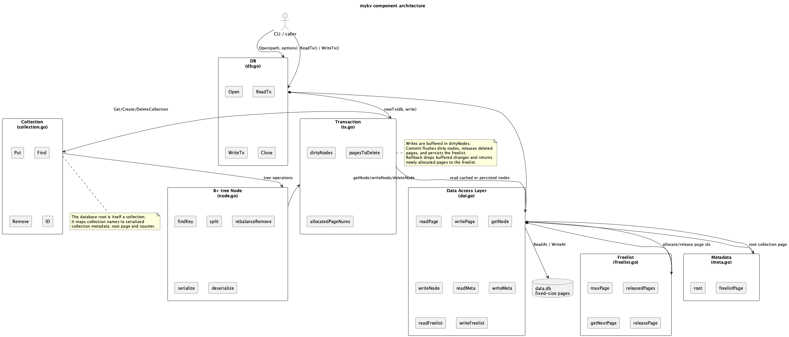
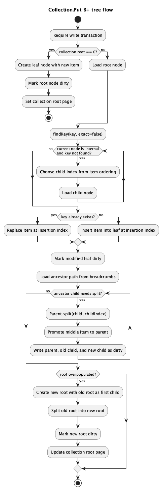

# Key-Value Store implementation

## Description
Key-Value Store implementation. The project is structured into several key components, each responsible for different aspects of the key-value store's functionality. The DAL manages low-level storage operations, the B+ tree provides efficient data structure operations, transactions ensure atomicity and isolation, and collections group related key-value pairs together.


## Design Architecture

### Overview

This document provides an overview of the design and architecture of the Key-Value Store project. The project implements a key-value store with persistence to disk and a B+ tree data structure.

### Diagrams

PlantUML source diagrams are available in `doc/img`:

#### Component architecture



#### B+ tree put flow



#### PlantUML sources

- [Component architecture](doc/img/architecture.puml)
- [Domain model](doc/img/domain-model.puml)
- [Write transaction flow](doc/img/write-transaction-flow.puml)
- [Read transaction flow](doc/img/read-transaction-flow.puml)
- [B+ tree put flow](doc/img/btree-put-flow.puml)
- [B+ tree remove flow](doc/img/btree-remove-flow.puml)
- [Persistent storage layout](doc/img/storage-layout.puml)
- [Serialized node page layout](doc/img/node-page-layout.puml)

Render them with PlantUML:

```sh
plantuml doc/img/*.puml
```


### Components

#### 1. Data Access Layer (DAL)

The Data Access Layer (DAL) is responsible for managing the storage and retrieval of data from the disk. It handles the low-level operations of reading and writing pages, managing free pages, and maintaining metadata.


##### Key Structures

- **dal**: The main structure representing the data access layer.
- **page**: Represents a disk page.
- **meta**: Contains metadata information.
- **freelist**: Manages free and used pages.

##### Key Functions

- **newDal**: Initializes a new DAL instance.
- **getSplitIndex**: Returns the index where a node should be split.
- **isOverPopulated**: Checks if a node is overpopulated.
- **isUnderPopulated**: Checks if a node is underpopulated.
- **readPage**: Reads a page from the file.
- **writePage**: Writes a page to the file.
- **getNode**: Retrieves a node from a page.
- **writeNode**: Writes a node to a page.
- **deleteNode**: Deletes a node by releasing its page.
- **readFreelist**: Reads the freelist from the file.
- **writeFreelist**: Writes the freelist to the file.
- **readMeta**: Reads the meta information from the file.
- **writeMeta**: Writes the meta information to the file.

#### 2. B+ Tree

The B+ tree is used as the underlying data structure for the key-value store. It provides efficient insertion, deletion, and search operations.

##### Key Structures

- **Node**: Represents a node in the B+ tree.
- **Item**: Represents a key-value pair.

##### Key Functions

- **newNode**: Creates a new node.
- **addItem**: Adds an item to a node.
- **split**: Splits a node when it becomes overpopulated.
- **rebalanceRemove**: Rebalances the tree after a remove operation.
- **findKey**: Searches for a key in the tree.
- **serialize**: Serializes a node to a byte array.
- **deserialize**: Deserializes a node from a byte array.

#### 3. Transactions

Transactions provide atomicity and isolation for operations on the key-value store. They ensure that changes are either fully applied or not applied at all.

##### Key Structures

- **tx**: Represents a transaction.
- **DB**: Represents the database and manages transactions.

##### Key Functions

- **newTx**: Creates a new transaction.
- **Commit**: Commits the changes made in the transaction.
- **Rollback**: Rolls back the changes made in the transaction.
- **ReadTx**: Starts a read-only transaction.
- **WriteTx**: Starts a read-write transaction.

#### 4. Collections

Collections group related key-value pairs together. Each collection is represented by a B+ tree.

##### Key Structures

- **Collection**: Represents a collection of key-value pairs.

##### Key Functions

- **newCollection**: Creates a new collection.
- **Put**: Adds a key-value pair to the collection.
- **Find**: Finds a key-value pair in the collection.
- **Remove**: Removes a key-value pair from the collection.
- **serialize**: Serializes a collection.
- **deserialize**: Deserializes a collection.

### Build and Test
```
Test
-- To run the tests, use the following command:

make build

```
